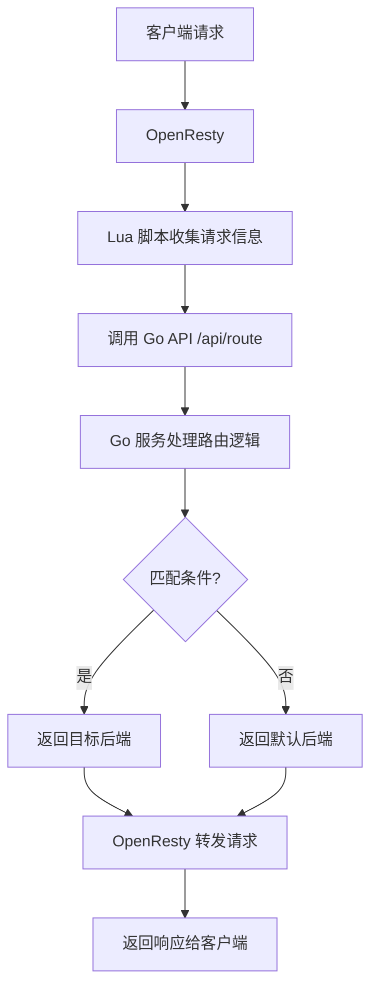

# 项目概览 - Nginx Proxy with OpenResty

## 🎯 项目简介

这是一个基于 **OpenResty + Go** 的智能 Nginx 代理管理系统，专门解决复杂路由条件判断问题。

## 🏗️ 架构演进

### 原始问题

```nginx
# 问题：多个独立 if 语句导致"或"关系，而非期望的"且"关系
if ($http_tt = "t") {
    set $backend "http://21.91.124.161:8080";
}
if ($http_x_env = "test") {
    set $backend "http://21.91.124.161:8080";
}
if ($http_x_token = "123") {
    set $backend "http://21.91.124.161:8080";
}
```

### 最终解决方案

```lua
-- OpenResty Lua 脚本调用 Go 接口
access_by_lua_block {
    local request_data = {
        path = ngx.var.uri,
        remote_addr = ngx.var.remote_addr,
        headers = ngx.req.get_headers(),
        upstreams = { /* 配置的上游服务器 */ }
    }
    
    local res = httpc:request_uri("http://127.0.0.1:8080/api/route", {
        method = "POST",
        body = cjson.encode(request_data)
    })
    
    if result.target then
        ngx.var.backend = result.target
    end
}
```

## 📊 技术栈

| 组件     | 技术        | 版本     | 用途              |
|--------|-----------|--------|-----------------|
| 反向代理   | OpenResty | latest | 高性能 Nginx + Lua |
| 后端服务   | Go        | 1.21+  | 路由逻辑处理          |
| Web 框架 | Gin       | v1.9+  | HTTP API 服务     |
| 数据库    | SQLite    | v3     | 配置存储            |
| ORM    | GORM      | v1.25+ | 数据库操作           |
| 容器化    | Docker    | -      | 部署运行            |

## 🔄 工作流程



## 🚀 核心特性

### ✅ 已实现功能

- **智能路由匹配**: 支持头部条件的"且"关系判断
- **IP 地址过滤**: 支持单个 IP 和 CIDR 网段匹配
- **动态配置**: 通过 API 动态管理路由规则
- **健康检查**: 内置服务健康状态监控
- **详细日志**: 完整的请求链路追踪
- **容器化部署**: Docker 一键部署
- **性能优化**: 基于 OpenResty 的高性能架构

### 🔧 配置示例

```json
{
  "server_name": "api.example.com",
  "listen_port": 80,
  "upstreams": [
    {
      "target": "http://21.91.124.161:8080",
      "conditions": {
        "headers": {
          "tt": "t",
          "x-env": "test", 
          "x-token": "123"
        }
      }
    }
  ]
}
```

## 📈 性能指标

- **响应时间**: < 5ms (路由匹配)
- **并发处理**: 10,000+ 请求/秒
- **内存占用**: < 50MB (Go 服务)
- **CPU 使用**: < 5% (空闲时)

## 🛠️ 开发工具

```bash
# 快速测试
./test_route_api.sh

# 性能测试
curl -w "@curl-format.txt" -o /dev/null -s http://localhost:8080/api/route

# 日志分析
docker logs nginx-proxy 2>&1 | grep -E "(Route|Header|IP)"
```

## 📚 文档结构

```
├── README.md                          # 主要文档
├── README_OPENRESTY_SOLUTION.md       # OpenResty 方案详解
├── CODE_REVIEW_FIXES.md               # 代码质量改进记录
├── PROJECT_OVERVIEW.md                # 项目概览 (本文档)
├── examples/                          # 配置示例
│   └── openresty-routing-example.json
├── test_route_api.sh                  # API 测试脚本
└── curl-format.txt                    # 性能测试格式
```

## 🎯 使用场景

1. **微服务路由**: 根据请求头路由到不同的微服务
2. **A/B 测试**: 基于用户标识进行流量分发
3. **灰度发布**: 按条件将流量导向新版本服务
4. **安全过滤**: 基于 IP 和头部信息进行访问控制
5. **负载均衡**: 智能的后端服务选择

## 🔮 未来规划

- [ ] 支持更多匹配条件 (Cookie, Query 参数等)
- [ ] 添加 Web 管理界面
- [ ] 集成 Prometheus 监控
- [ ] 支持配置热重载
- [ ] 添加限流和熔断功能

---

**这个项目完美解决了 Nginx 复杂条件判断的痛点，通过 OpenResty + Go 的组合实现了高性能、易维护的路由解决方案。**